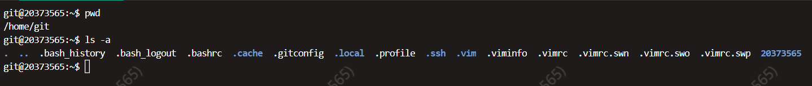
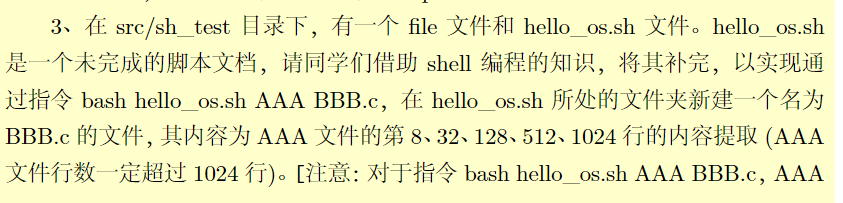
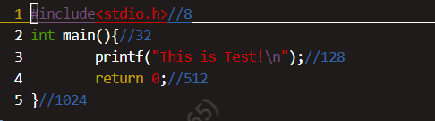

# 挑一些趁手的配置【Vim】

> Vim是编辑器之神（ps：上古的

## 闲扯

Vim是编辑器之神，熟练Vim的码农可以在神的指引下化身触手怪，键盘手里敲，舍友天上飞。

但原生的Vim就像是毛胚房，连水电都没有的毛胚房住起来是相当痛苦的。

所以我们得来调教一下Vim

对于Vim的调教主要有三种境界

- 第一种境界 自我 

  会配置vimrc，改改键位

- 第二种境界 本我

  能用插件，成年人的第一款客制化编辑器get

- 第三种境界 超我

  自个儿写插件，大神都是哪里不顺心哪里自己写

  鄙人不才，尚且处于第零种境界（我抄），什么都不会，只会CV网络资源

  > 还有第0.5种境界，用spaceVim等开箱即用的VimIDE

本来想着装装插件，把语法自动补全和目录树配置了，但是跳板机只支持软件源列表内的下载，遂作罢

以下是找到的一些配置方案和小trick，供诸君共赏

...


## Vimrc配置

 在home/git目录下创建.vimrc文件 然后当一个CV工程师就好了



```c
" ctag
set tags=tags
set autochdir
" BracketHighlighter 括号匹配高亮
set showmatch
" show line number 显示行号
set number
" Syntax highlighting 语法高亮
syntax on
" set indent style (indent style of C/C++/Java) 默认缩进方式为结构化语言缩进方式
set cindent
" tab size (default is 8) tab设置为4空格
set tabstop=4
set softtabstop=4
" default indent (default is 8)
set shiftwidth=4
" Highlight search 搜索结果高亮
set hlsearch
" search when type the word after </> 输入立即搜索，不等待enter
set incsearch
" Case insensitive search 不区分大小写的搜索
set ignorecase
" encoding mode 支持中文的编码模式
set encoding=utf-8
" Highlight current line 突出当前行
set cursorline
" open mouse function (c means CLI mode) 打开鼠标功能，支持滚轮和ctrl-c和ctrl-v
set mouse=c
" let current line special 当前行的行号高亮，其余行号白色
highlight clear LineNr
" Auto fold code 自动折叠代码
set nofoldenable
" Show list instead of just completing 在命令模式下按tab可以帮助补全命令
set wildmenu
set wildmode=list:longest
```

- 为什么要叫做vimrc？？？？

> "rc" 是取自 "runcom", 来自麻省理工学院在 1965 年发展的 CTSS系统。相关文献曾记载这一段话: '具有从档案中取出一系列命令来执行的功能；这称为 "run commands" 又称为 "runcom"，而这种档案又称为一个 runcom (a runcom)。
> https://www.jianshu.com/p/02afbce73b88


## 几个小功能

- 命令行模式下输入数字可以直接跳转到数字对应的行

  可以帮助完成下面的题目（虽然用num+hjkl也可以）

  

  

- `shift`+`a`可以快速移动到行末，并且进入append模式，一般我在定位后用这个进入编辑模式

- 书签功能

  - `:mark {%}`

    为当前行创建书签，%为单字符

  - `:'`

    其实没什么用，不想用了覆盖就行

  > example

  ```c
  :mark H "hello文件第666行
  :mark R	"world文件第999行
  :marks //在第未知行瞧一眼
  :'H  //冲
  //穿越到hello文件第666行
  ```


ps：有什么问题都可以STFW OR RTFM

pps：适度配置怡情，沉迷配置伤身

ppps：vscode yyds